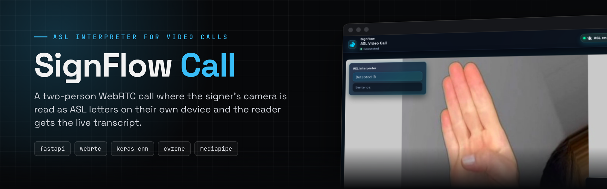
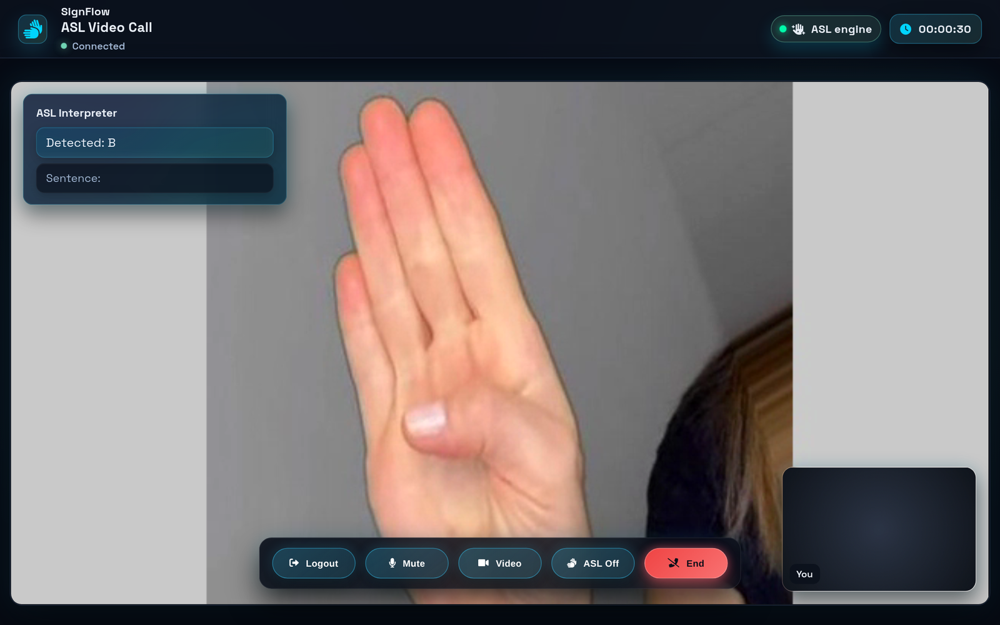
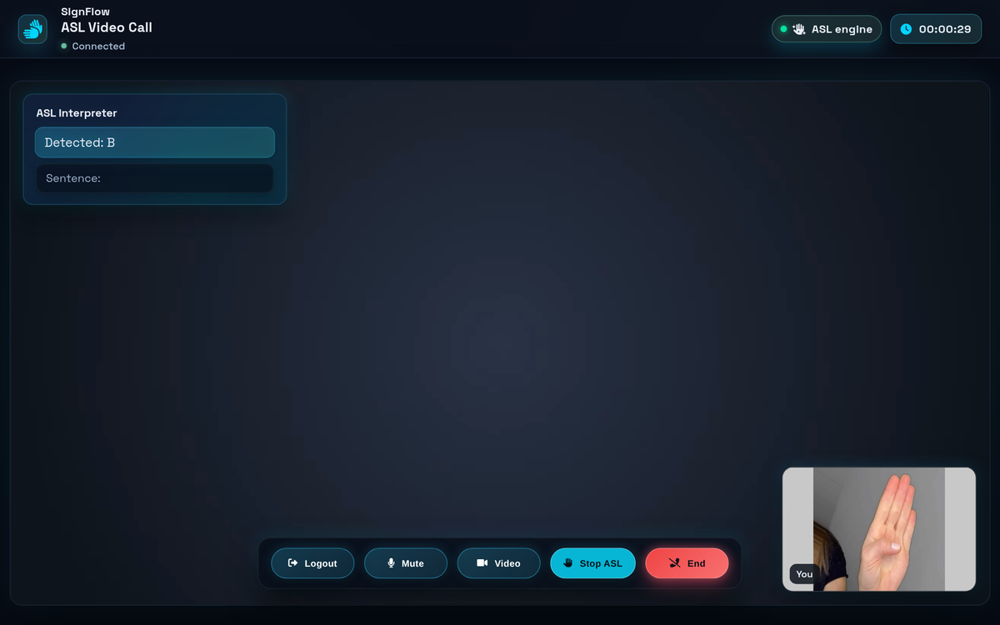
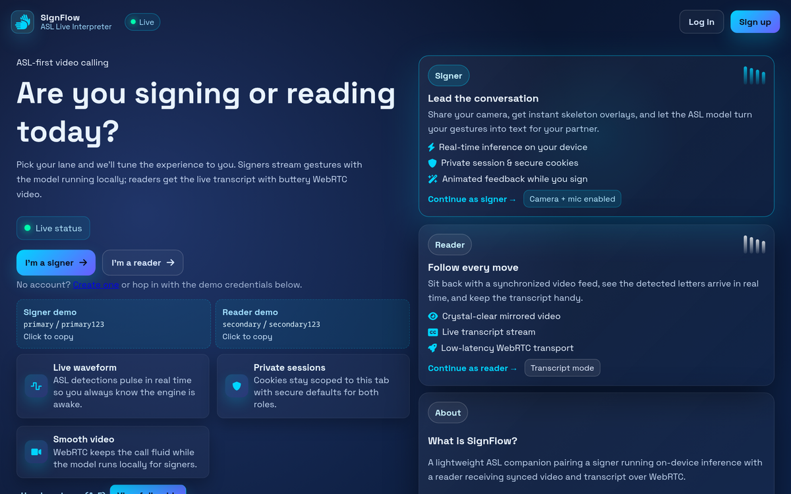
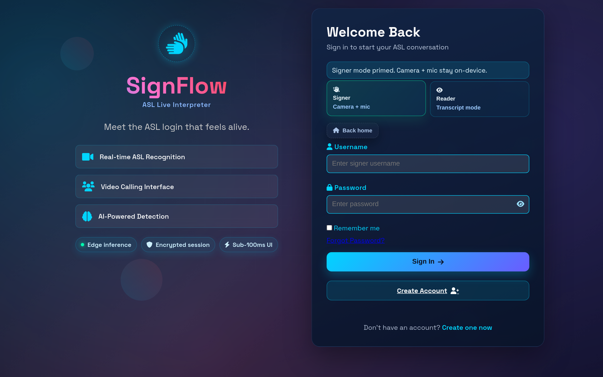
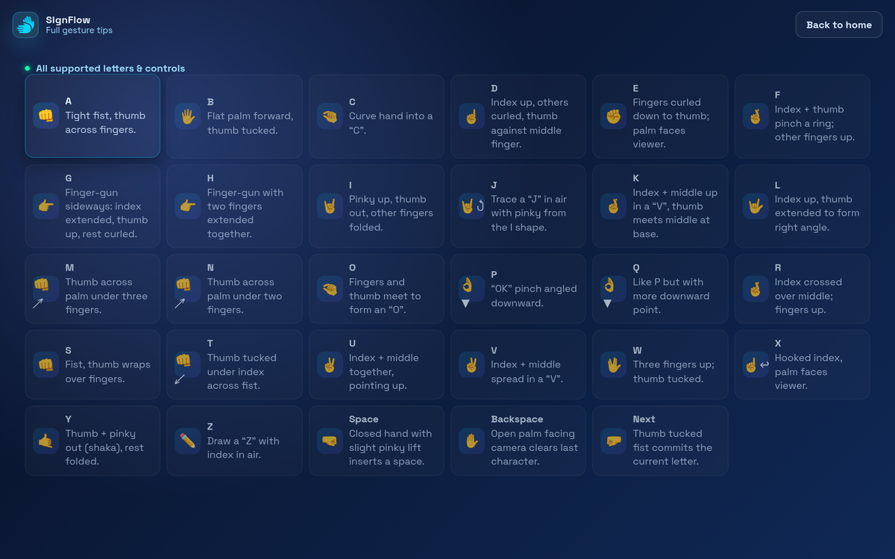

<div align="center">



<br>

[](camera_feed.py)
[](templates/in_call.html)
[](cnn8grps_rad1_model.h5)
[](requirements.txt)

**A FastAPI + WebRTC app that turns a two-person video call into a live ASL interpreter.**
The signer's camera is read as ASL letters on their side; the reader sees the video and a synced transcript.

[Screenshots](#screenshots) · [Highlights](#highlights) · [Setup](#setup) · [Run](#run) · [API](#routes--api) · [Gestures](#gestures-supported)

</div>

---

## Screenshots



<p align="center"><sub><b>Reader's view of a live call.</b> The signer's video arrives over WebRTC and the interpreter panel shows the letter detected on the signer's side.</sub></p>

<table>
<tr>
<td width="50%"></td>
<td width="50%"></td>
</tr>
<tr>
<td align="center"><sub><b>Signer's view.</b> Frames go to <code>/predict</code>; the result is shared with the reader.</sub></td>
<td align="center"><sub><b>Landing page.</b> Pick a lane; demo credentials copy with a click.</sub></td>
</tr>
<tr>
<td width="50%"></td>
<td width="50%"></td>
</tr>
<tr>
<td align="center"><sub><b>Role-aware login.</b> Signer (camera + mic) or reader (transcript).</sub></td>
<td align="center"><sub><b>Gesture tips.</b> Every letter and control gesture at <code>/tips</code>.</sub></td>
</tr>
</table>

<sub>The two call screenshots come from a real call between two browser sessions on one machine. The signer's
webcam was a still image from a public ASL alphabet dataset fed through Chromium's fake camera.</sub>

## Highlights
- New animated landing page at `/` with role selector and copy-to-clipboard demo credentials.
- Role-aware auth flow: email + username + password, PBKDF2-SHA256 (200k rounds) with per-user salt, 12h session cookie, default demo accounts seeded.
- ASL alphabet (A–Z) plus helper gestures: space, next, backspace; smoothing mirrors the desktop `final_pred` flow.
- WebRTC media path with TURN/STUN env overrides; WebSocket signaling with HTTP polling fallback.
- Gesture cheat sheet at `/tips`, live stats and latency sparkline in the call UI, and a standalone Tkinter interpreter for offline testing.

## Project Layout
- `camera_feed.py` — FastAPI app, auth, signaling, ASL inference pipeline.
- `templates/home.html` — landing + role selector and demo creds.
- `templates/login.html`, `templates/signup.html` — role-aware authentication screens.
- `templates/in_call.html` — call surface with controls, transcript, and ASL toggle.
- `templates/tips.html` — full gesture reference.
- `static/css/style.css` — shared styling and motion assets.
- `cnn8grps_rad1_model.h5` — trained alphabet classifier (required).
- `signflow.db` — SQLite store created and seeded on startup (git-ignored).
- `simple_interpreter.py` — standalone Tkinter webcam interpreter demo.
- `requirements.txt` — pinned dependencies (TensorFlow 2.13 on Python 3.10–3.11; Windows-only packages are gated by platform markers).

## Requirements
- Python 3.10 or 3.11
- Camera and microphone
- ~2 GB free disk for TensorFlow + the model

## Setup
```bash
python -m venv venv
.\venv\Scripts\activate      # Windows
# source venv/bin/activate   # macOS/Linux
python -m pip install --upgrade pip
pip install -r requirements.txt
```
If TensorFlow fails on CPU-only machines, try `pip install tensorflow-cpu==2.13.1`.

## Run
```bash
uvicorn camera_feed:app --reload --host 0.0.0.0 --port 8000
```
- Visit `http://localhost:8000/`, pick **Signer** or **Reader**, or jump straight to `/login`/`/signup`.
- Demo accounts: `primary` / `primary123` (signer) and `secondary` / `secondary123` (reader). Pick the matching **Signer** or **Reader** chip on the login page; the session takes the role you pick.
- Only the signer role sends frames to `/predict`; the reader receives video + transcript.
- Allow camera/mic; detections run ~20 FPS and share current letter + sentence live.

## Routes / API
- `GET /` — landing + role chooser and demo creds.
- `GET /login` — login (clears stale sessions); `GET /signup` — email/username/password + role.
- `GET /call` — authenticated call UI (requires `session` cookie).
- `GET /tips` — gesture cheat sheet.
- `POST /signup` — create user; `POST /login` — authenticate; `POST /logout` — clear session.
- `POST /predict` — auth required; accepts JPEG bytes or JSON `{ "image": "data:...base64" }`; returns `{"letter": "...", "sentence": "..."}`.
- `GET /live_result` — latest detected letter/sentence for polling.
- `POST /signal/send` / `GET /signal/recv` — HTTP signaling fallback.
- `WS /ws/signaling` — WebSocket signaling (preferred when available).
- `POST /reset_state` — clears prediction buffers (used on auth transitions).

## Gestures Supported
- Alphabet A–Z.
- Controls: `next` commits the last stable letter; `Backspace` removes the last character; closed hand with slight pinky lift inserts a space. Full visuals live at `/tips`.

## Configuration
- `TURN_URLS`, `TURN_USER`, `TURN_PASS` — override TURN relays (defaults to openrelay.metered.ca).
- `STUN_URLS` — override STUN servers (defaults to Google STUN).
- Adjust `mirror_input`, `smoothing_window`, and other inference flags in `camera_feed.py` if you need different tracking behavior.

## Troubleshooting
- If video appears flipped, toggle `mirror_input` in `camera_feed.py` (UI preview stays mirrored for comfort).
- Delete `signflow.db` to reset users/sessions; it will be recreated on next start.
- Keep the model file in the repo root or update the path in `camera_feed.py`.
- For better confidence: good lighting and keep hand diagonal roughly 120–250 px.

## Roadmap
- Swap in a compact gesture vocabulary (yes/no/hello/thanks/help) alongside alphabet mode.
- Export a lighter model for edge devices and optionally add a GPU build path.
- Wire live stats/latency in the UI to real measurements instead of simulated pulses.
- Add tests for auth/session flows and `/predict` smoothing behavior.
